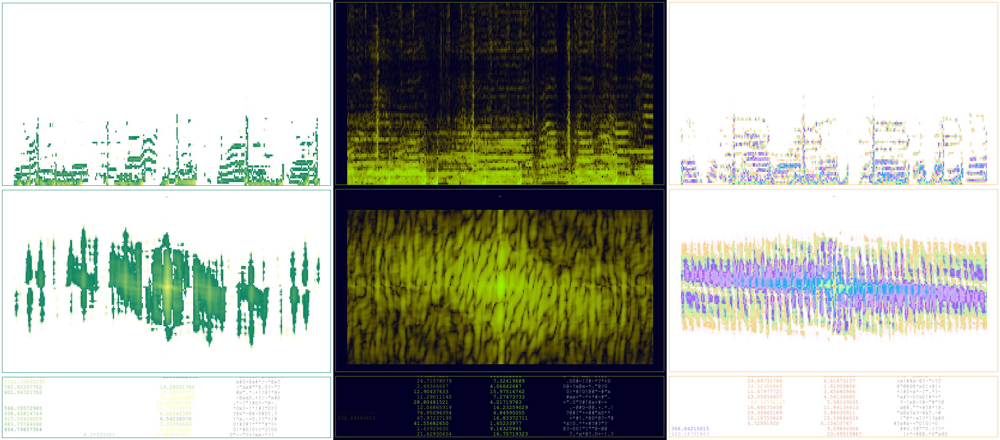

# Visualizer
This is a real-time audio visualizer built with PyQt5, PyAudio, and pyqtgraph. It creates a dynamic spectrogram that reacts to sound input from your microphone, displaying a frequency-domain transformation of the sound. The visualizer also includes customizable themes using JSON. 

## Screenshot


## Requirements
To run the visualizer, you need the following Python packages:

```bash
pip install numpy pyaudio PyQt5 pyqtgraph matplotlib
```
## How to run
1. Clone or download this repository.
2. Install the required packages.
3. Run the visualizer using:

```bash
python visualizer.py [theme_name]
```

If no theme is specified, it defaults to "summer" theme.

*NOTE* Depending on how your system is setup, the wrong pyaudio device might be selected. To list all pyaudio devices, run the following code:
```python
import pyaudio
p = pyaudio.PyAudio()
for i in range(p.get_device_count()):
    print(p.get_device_info_by_index(i))

```
And change the DEFAULT_DEVICE variable in visualizer.py to the index corresponding to your preferred pyaudio device.
